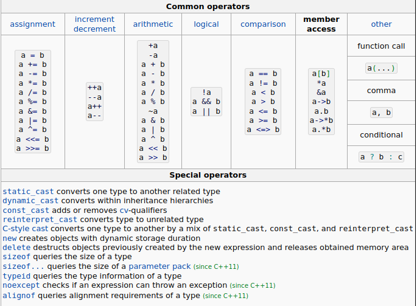
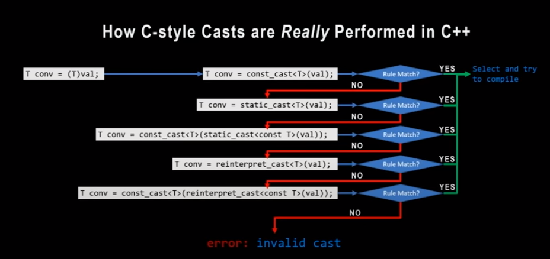

# Learn cpp

## Operators



## [Undefined behaviour](https://en.cppreference.com/w/cpp/language/ub)

cf. https://blog.regehr.org/archives/213

The good thing — the only good thing! — about undefined behavior in C/C++ is that it simplifies the compiler’s job
Most known undefined behaviours :
- Use of an uninitialized variable : `bool b; if(b) {...}`
- Signed integer overflow : `int a = INT_MAX + 1;` 
- Oversized Shift Amounts :  `int a = (1 << 32);`
- Out of Bounds Array Accesses : `int arr[1] = {42}; int a = arr[1];`
- Dereferencing a NULL Pointer : `int *a = nullptr; cout << *a;`
- Violating Type Rules : It is undefined behavior to cast an int* to a float* and dereference it (accessing the "int" as if it were a "float")

## [Pointers](https://en.cppreference.com/w/cpp/language/pointer)

```cpp
int n;
int* np = &n; // pointer to int

int a[2];
int* p1 = a; // pointer to the first element a[0] (an int) of the array a
int (*ap)[2] = &a; // pointer to array of int
struct C
{
    int x, y;
} c;
 
int* px = &c.x;   // value of px is "pointer to c.x"
int* pxe= px + 1; // value of pxe is "pointer past the end of c.x"

void f(int);
void (*p1)(int) = &f;
void (*p2)(int) = f; // same as &f

int *a = nullptr; // null pointer
```

## Conversions

`In all cases, it would be better if the cast - new or old - could be eliminated`

- [Implicit type conversion](https://en.cppreference.com/w/c/language/conversion)
  - at assignment, automatic cast may be performed : float <-> double <-> int <-> char
  - Arithmetic type conversion : 
    `uint8_t a = 10; uint8_t b = 50; // a + b est de type int et non uint8_t ` 
  - Sign conversion
  - User conversion
- [Explicit type conversion](https://en.cppreference.com/w/cpp/language/explicit_cast) aka cast
  - C cast : `(type) var;`
    - change the meaning of the bytes
    - can fail to compile
    - can cause undefined behavior
    - function ptrs are types, can cast em
    - plusieurs opérations possible via le cast
  - C++ cast : `<type>(var)`
    4 keywords : 
    - static_cast :
      - clarify implicit conversion : `float f = static_cast<float>(42);`
      - indicate intentional truncation : `uint8_t u = static_cast<uint8_t>(1.75f*f);`
      - cast between base and derived : ⚠️ pb si plusieurs classes héritent de la classe mère cf. [explication](https://youtu.be/2h2hdRqRIRk?list=PLHTh1InhhwT4TJaHBVWzvBOYhp27UO7mI&t=979)
      - cast between void* and T*
      - not infaillible
    - const_cast :
      - remove or add const qualifier from or to a variable (not really working as expected ? ask Jordi)
    - dynamic_cast :
      - require RTTI (Run Time Type information, can be disabled to save space)
      - see if To is in the same public inheritance tree as From
      - can only be a ref or ptr
      - From must be polymorphic
      - can be expensive
    - reintrepret_cast
      - ~C cast
      - useful for memory mapped functionality
      - should avoid to use it
      - Type aliasing : act of using memory of one type as if itt were another one when the memory layout of the 2 types are compatible, eg. for structs with same nb and type of attributes



⚠️ il ne faut jamais utiliser les cast de type C : `int32_t toto = (int32_t) my_float;`,
mais les static_cast : `int n = static_cast<int>(3.14);`

## Values

- rvalues
- lvalues